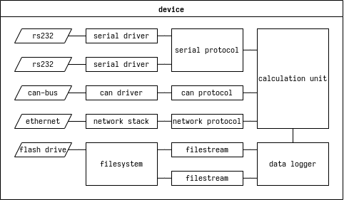
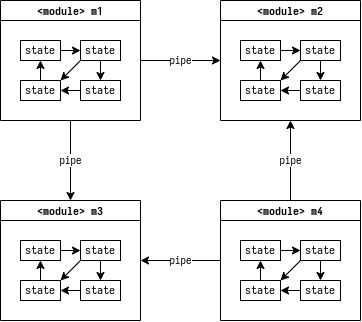
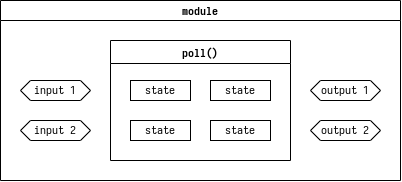
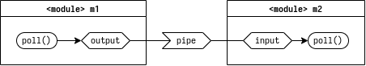
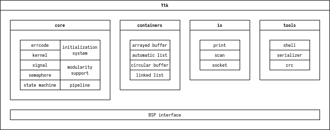

# Idea #

Idea is simple: almost all embedded software required the software that provides functionelity like a boost or stl libraries. Sometimes (almost always) you can't use huge parts of this because there is no solutons to implement machine specific code of standard library or it's will be not effective. Many embedded coders avoid using large part of good code and reintvent the bicycle every time they start to code.

There is no any extra features, just unificated set of tools that combine everyday routines.

# Features #

* pipelined architecture support

* modularity support

* dependency-based initialization system

# Limitations #

* to use whole library as base of your project be sure that the projectg is fully deterministic, because you can't load externl code

* there is no any hardware specific tools, you should write it yourself.

* when you use isolated parts of the library, mind that it isn't thread safe

# Approach #

Often when we implement complex behavior in embedded platforms we automatically use the multitasking and operating system. But also we need to make device fast and furious. This library provides superloop approach that can easily apply large applications with complex behavior as in the os-based projects, but with another tools and mindset. This behaviour is tightly coupled with state machines and manual control of execution time.

Another key concept is modularity. Tiny code blocks managed by state machines may be gathered in modules. Modules can interact multiple ways. Interaction is focused on pipeline architecture. It's pretty simple and applicable for many embedded projects. Also modules can exchange simple messages that called signals.

I have seen many projects with common problem: initialization chaos. Ytk has initialization subsystem that includes dependencies and semi-parallel execution. You can easily make dependency graphs and initialization system guarantee the order of execution of procedures. As this system is not fast there is the way to make manual initialization routine.

## Pipelined architecture ##

After your project becomes large it required some kind of system architecture. Most embedded devices I seen were data capture systems. It may have diffirent names or not so sommon behaviour for user but it's structure commonly just tool to capture data, store it inside, may be perform some calculations and put to the user. Pipelined architecture almost always perfectly fits for this purposes. Typical embedded device functional block diagram is shown on a figure below.

Here you can see set peripherial interfaces that connected to device drivers. Device drivers in one hand perform register memory operations, and in another hand make raw data stream from obtained data. An in another direction from raw data stream makes a set of register memory operations. After that drivers communicate with protocols that perform more specific work. Protocols provide a data set and api to manipulate raw data. For example serial protocol for couple of temperature sensors automatically poll it and represent actual values. Network protocol may be http server that operates textual data streams. Network stack is more specific thing but commonly it still converter with extended control set. And finally we have some things that we prefer to call "application", that make our device useful. In this example it is calculation unit and data logger. As you see this structure is common for thousands types of embedded devices.

In pipelined approach system becomes as set of isolated modules that interacts together with data channels called pipes as shown in figure next.

As this library is state-machine based I draw containment of modules as state-machine. But pipeline architecture actually does not care about what's inside the modules. Here is four modules that exchange data with common method for all system. You can easily convert functional diagram like I show in diagram of typical device to pipelined. You see set of blocks that can be interpreted as modules and data flows that you can run through pipes.

## Modularity ##

Modularity is important for maintainig feature. Module is an independent code unit, it depends only on framework, not the system or hardware. Independent also means that it can run standalone and it doesn't care about environment where it placed, it will work everywheresame way. Often modules even have a separate repository in code base. Advantage of this method is make possible improve all of the projects by fixing bug in a small module. Also it makes possible to reach ultimate portability.

So what is module? It's just a cpp class that has behaviour and set of inputs and outputs, as shown on a figure below.

Inputs and outputs is connection points to place your module in your project via pipelines. Pipelines are similar to the wires in physical distributed systems.

# Licence #

Asshole public licence: if you like this code, just tell your buddies about it or you'll be an asshole.

Yes, it's the full text of the licence. Simple, right?

# Build #

# Testing #

To perform test the CppUTest package required.

# Warning #

This code is written in spare time, maybe it's not documented or tested properly, but I tried to make it usable and robust.

# Packaging #

Library consists of core, container, io, tools and board support packages. Some component are independent but most of them tightly coupled together. Almost all of them depend on BSP interface. If you want use isolated components like containers you still should imlpement BSP calls.

## Core ##

## Containers ##

## IO ##

## Tools ##

## BSP ##
