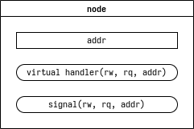

# Idea #

Idea is simple: almost all embedded software required the software that provides functionelity like a boost or stl libraries. Sometimes (almost always) you can't use huge parts of this because there is no solutons to implement machine specific code of standard library or it's will be not effective. Many embedded coders avoid using large part of good code and reintvent the bicycle every time they start to code.

There is no any extra features, just unificated set of tools that combine everyday routines.

# Features #

* pipelined architecture support

* modularity support

* dependency-based initialization system

# Limitations #

* to use whole library as base of your project be sure that the projectg is fully deterministic, because you can't load externl code

* there is no any hardware specific tools, you should write it yourself.

* when you use isolated parts of the library, mind that it isn't thread safe

# Approach #

Often when we implement complex behavior in embedded platforms we automatically use the multitasking and operating system. But also we need to make device fast and furious. This library provides superloop approach that can easily apply large applications with complex behavior as in the os-based projects, but with another tools and mindset. This behaviour is tightly coupled with state machines and manual control of execution time.

Another key concept is modularity. Tiny code blocks managed by state machines may be gathered in modules. Modules can interact multiple ways. Interaction is focused on pipeline architecture. It's pretty simple and applicable for many embedded projects. Also modules can exchange simple messages that called signals.

I have seen many projects with common problem: initialization chaos. Ytk has initialization subsystem that includes dependencies and semi-parallel execution. You can easily make dependency graphs and initialization system guarantee the order of execution of procedures. As this system is not fast there is the way to make manual initialization routine.

## Pipelined Architecture ##

After your project becomes large it required some kind of system architecture. Most embedded devices I seen were data capture systems. It may have diffirent names or not so sommon behaviour for user but it's structure commonly just tool to capture data, store it inside, may be perform some calculations and put to the user. Pipelined architecture almost always perfectly fits for this purposes. Typical embedded device functional block diagram is shown on a figure below.


Here you can see set peripherial interfaces that connected to device drivers. Device drivers in one hand perform register memory operations, and in another hand make raw data stream from obtained data. An in another direction from raw data stream makes a set of register memory operations. After that drivers communicate with protocols that perform more specific work. Protocols provide a data set and api to manipulate raw data. For example serial protocol for couple of temperature sensors automatically poll it and represent actual values. Network protocol may be http server that operates textual data streams. Network stack is more specific thing but commonly it still converter with extended control set. And finally we have some things that we prefer to call "application", that make our device useful. In this example it is calculation unit and data logger. As you see this structure is common for thousands types of embedded devices.

In pipelined approach system becomes as set of isolated modules that interacts together with data channels called pipes as shown in figure next.


As this library is state-machine based I draw containment of modules as state-machine. But pipeline architecture actually does not care about what's inside the modules. Here is four modules that exchange data with common method for all system. You can easily convert functional diagram like I show in diagram of typical device to pipelined. You see set of blocks that can be interpreted as modules and data flows that you can run through pipes.

## Modularity ##

Modularity is important for maintainig feature. Module is an independent code unit, it depends only on framework, not the system or hardware. Independent also means that it can run standalone and it doesn't care about environment where it placed, it will work everywheresame way. Often modules even have a separate repository in code base. Advantage of this method is make possible improve all of the projects by fixing bug in a small module. Also it makes possible to reach ultimate portability.

So what is module? It's just a cpp class that has behaviour and set of inputs and outputs, as shown on a figure below.


Inputs and outputs is connection points to place your module in your project via pipelines. Pipelines are similar to the wires in physical distributed systems.


## Service Orientied Architecture and Distributed Systems ##

This concept is another view on the modularity problem and how the modules interact together. This architecture can be combined with the pipelined architecture, but in doesn't replace it. It just another way to code organization that helps you to make system maintainance easier and efficent. Service Orientied Architecture says that there is a set of modules, thath interact together using common mechanism and some modules would be servers and some would be clients. This mechanism is System Bus. System Bus provides data exchange mechanism for whole system with global address space. It utilizes simple serial interface to exchange data between devices and inner device loop.


Nodes are entry point to the bus. It have their own address, method to send messages to another nodes called signel, and method to catch and handle signals called handler. Address space can contain 256 nodes.




Devices in the bus are connected in the loop that can contains maximum 16 devices. Message format is next:


Every node whould have an unique address. Messages propagates between devices with decreasing TTL field. Message with TTL == 0 will not be retransmitted. Also there is internal loop like loopback in TCP/IP stacks.

## Data Exchange Protocols ##

Connecting to another device with its own wired communication protocol is a common task in the worl of embedded systems. In fact, a huge part of embedded systems are data acquisition systems that simply collect data from several third-party devices, convert it into another representation, and send it to a compute module or desktop PC. Sometimes they accumulate the collected data in their internal memory. Every project I've seen has a terrible and oversized part of the data exchange code. Each communication protocol was written in its own stype, with it's own and unique approach, and this practice still seems to be normal. But, in my opinion, this is wrong, because in fact most of protocols that I have seen have a fairly similar structure. I sincerely believe that the individuality of each communication process is greatly overestimated, and the set of tools in this project can facilitate the development of the communication part of yout project.

There are several ways to implement the data protocol, but at the moment I can only provide one of them. This approach doesn't promise minimal footprint or extraordinary speed, but is not the worst by these metrics, and also increases the speed of implementation and makes the behaviour predictable and stable.

Typically, devices interact with messages that have predictable boundaries and order of exchange. In most cases, the message begins with a header, which may describe the message type, adderssing, total length, etc. The message continues with payload data, which may in fact be a diffirent protocol or format. Finally, the messages may be signed in some way, but this is usually a variant of the checksum or an explicit terminating character. Sometimes the message ends with just a pause. At the lower leverl, the message is a seguence of data fields. If we dig a little deeper, we can see thet these fields are a sequence of bytes.

Protocol implementation consists of several parts:

* part that recognize input stream, called parser,

* part that convert data set to output stream, called generator,

* data accumulation buffer,

* business logic that glue all parts together.

Serializer and deserializer provides a simple toolset to pack and extract various data fields in data streams. You can describe order of fields as an orderes set of calls. For example you see in device documents something like that:


To serialize this sequence you can use code like this:

```
...
uint16_t addr;
uint8_t len;
uint32_t count;
...
uint8_t buffer[100];
serializer out(buffer, sizeof(buffer));
out.v<uint16_t>(addr).v<uint8_t>(len).v<uint32_t>(count);
if (out.error == ERR_OK) { tx(buffer, out.pos); } 
...
```

Extraction from the buffer is the same way:

```
...
uint16_t addr;
uint8_t len;
uint32_t count;
...
uint8_t input_buffer[100];
deserializer in(buffer, sizeof(buffer));
in.v<uint16_t>(addr).v<uint8_t>(len).v<unit32_t>(count);
if (in.error != ERR_OK) { break; }
...
```

Pretty easy, isn't it?

Look at a little bit complex example. Imagine you have a simple, but complete protocol.


Most likely it would be a class with the following entities:

* data input - it's a method or an interface that provide insertion serial data inside the protocol, it needs to quickly apply data data from remote device without processing data right now, but this is not necessary component

* data output - it's a method or an interface that provide extrection serial data to transmit outside of the protocol, it needs to make able delayed data transmittion, but this it not necessary component

* input buffer - it's a data structure needed to collect data for parsing

* output buffer - it's a data structure needed for temporary storage the data before it would be transmitted or handler outside of the protocol

* set of the requests to the protocol - it's a methods, variables or other data structures that stimulate protocol to perform its actions, for example it may be request to activate relay on a module, or set angle required angle of a servo

* set of protocol data fields - it's a variables or other data structures that represents data that protocol operates, for example it may be coordinates of GNSS or calibration data that should be applied while device initialization

* set of the events and their events - it's a methods, callbacks, flags or other data structures, that stimulate protocol to perform its actions, for example, protocol should notify another piece of code that message arrived, or automatically answer, or maybe transmit messages by schedule

* data stream parser - it's a method that extracts data from the input stream

* data stream generator - it's a methot that pack the data to the output stream

Protocol set on its data fields only actual data values. Data insertion and extraction data are quick. When you implement your own code you can use list above as a checklist to test requirements, and you will see that most of it would be useful.

Finally, let's dive a little deeper:


On the scheme diamond and arrowed units describes an action and action direction. In upper part you see the parser. It triggers by receiver that pushes byte to input buffer. In some moments later (or may be immediately, as you wish) containment of the buffer should be verified by validator. It would check message length, checksum, addressing or something like this. This action repeats many times. As message sould be recognized as valid deserializer starts its work. It unpacks message fields to protocol data fields in order of calls like described in serializer tools descriptions. Same format use serializer so you can describe order like a preprocessor macro and use it both with serializer and deserializer.

When you need to transmit some data, request or inner business logic proparates serializer and immediately start to combine the output message. After that it should be signed by checksum or anything you need. And finally this message should be transmitted.

As you see, the protocols may have complex structure and behaviour, but it have a lot in common. Moreover, in my opinion it can be standardized, as it once did with text parsers. You can create your protocols quickly and easily using this approach. One day I will figure out how to make a serial protocol generator similar to lex and yacc but for non-textual data.

System bus implemented in similar approach, see it for more comprehensive example. This part is still under construct but it has maximum priority and soon you will see it complete.

# Licence #

Asshole public licence: if you like this code, just tell your buddies about it or you'll be an asshole.

Yes, it's the full text of the licence. Simple, right?

# Build #

# Testing #

To perform test the CppUTest package required.

# Warning #

This code is written in spare time, maybe it's not documented or tested properly, but I tried to make it usable and robust.

# Packaging #


Library consists of core, container, io, tools and board support packages. Some component are independent but most of them tightly coupled together. Almost all of them depend on BSP interface. If you want use isolated components like containers you still should imlpement BSP calls.

## Core ##

## Containers ##

## IO ##

## Tools ##

## BSP ##
